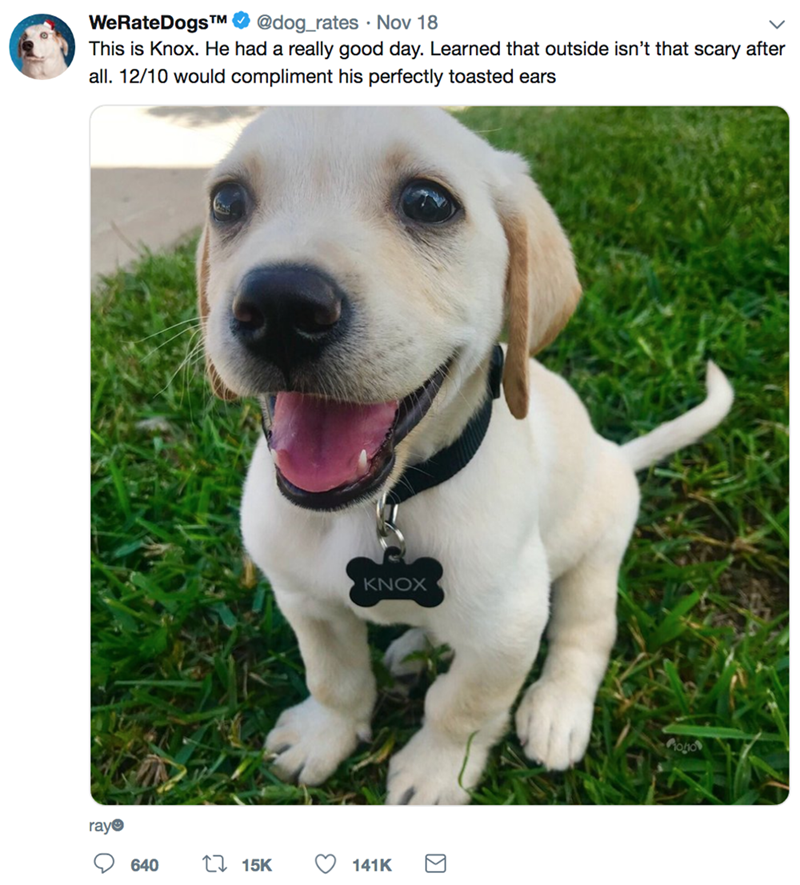
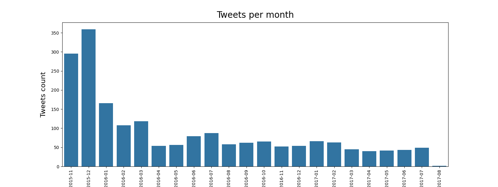
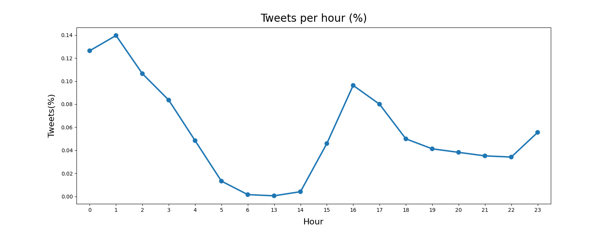
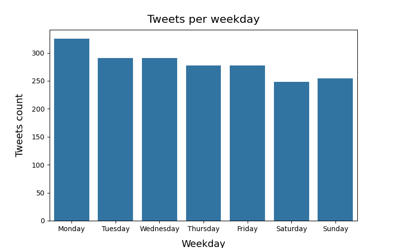
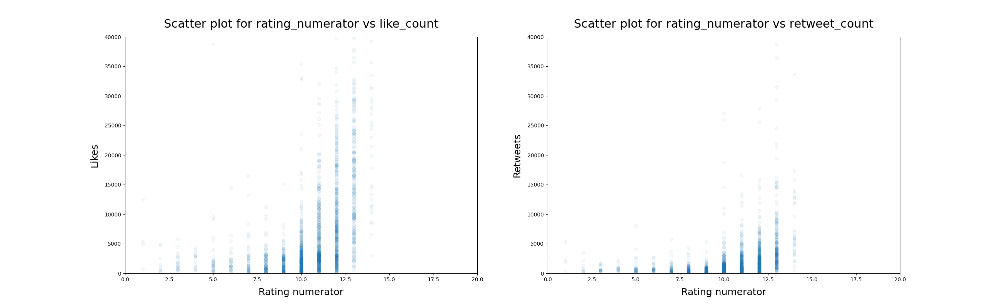
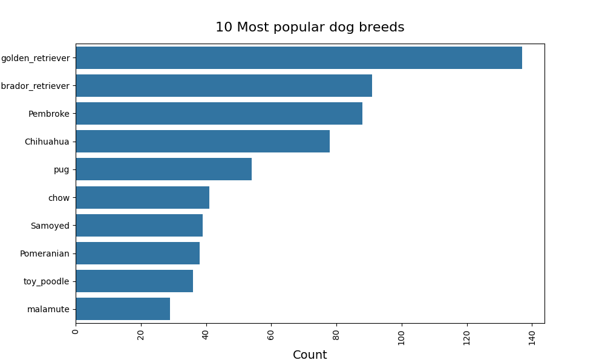

# WeRateDogs Twitter Archive Analysis

## Introduction
[WeRateDogs](https://en.wikipedia.org/wiki/WeRateDogs) is a Twitter account that rates people's dogs with a humorous comments about the dog. As this one here:

This analysis explores a dataset containing WeRateDogs's Twitter archive covering the period from November 2015 to August 2017.

## Wrangle Report
### Dataset

[WeRateDogs](https://en.wikipedia.org/wiki/WeRateDog) is a Twitter account that rates people's dogs with a humorous comments about the dog. This analysis explores a dataset containing WeRateDogs's Twitter archive covering the period from November 2015 to August 2017.

The data was spread between three sources:
1. Twitter archive data that WeRateDogs downloaded and sent to the Udacity team, which parsed the data and stored it in `twitter_archive_enhanced.csv` file. 
2. The dogs' breed predictions were based on the tweet's image(s), which was performed by Udacity team using a neural network, and was stored in `image_predictions.tsv` file. 
3. Additional data (retweet count - reply count - like count - quote count) was gathered from Twitter's API and was stored in `tweet_json.txt` file.

### Data Gathering
The methods required to gather each data are different:
- Twitter archive data `twitter_archive_enhanced.csv` was downloaded manually from Udacity classroom and then uploaded into `archive_data` Dataframe. 
- While image predictions file `image_predictions.tsv` was downloaded programmatically using the [Requests library](https://pypi.org/project/requests/), then was uploaded into `img_pred` Dataframe. 
- Lastly, each tweet's JSON data returned from the Twitter API query was written in its own line in `tweet_json.txt`. Pandas then read this .txt file line by line into `api_data` DataFrame.

### Data Assessment
> Two types of assessment were performed:
- **Visual Assessment**: Data is displayed in both the Notebook and JupyterLab text editor for visual assessment.
- **Programmatic Assessment**: Using Pandas functions and methods for assessment (.info, .sample, .describe, …).

This led to discovering 13 quality issues and 3 tidiness issues in the three DataFrames.

### Data Cleaning
> All cleaning steps were done using (Define - Code - Test) framework. 

#### Summarization  of data cleaning efforts:
- Create a copy of the three original Dataframes.
- Correct erroneous datatypes in all tables.
- Correct invalid values of `rating_denominator` column in `archive_data` table.
- Correct invalid values of `rating_numerator` column in `archive_data` table.
- In `archive_data` table, replace invalid values in `name` column with 'NaN'.
- In `archive_data` table, combine the four columns `doggo`, `floofer`, `pupper`, `puppo` to create `dog_stage` column, then drop the four columns.
- Correct invalid values in the new `dog_stage` column.
- Remove rows that are replies from `archive_data` table. 
- Remove rows that are retweets from `archive_data` table. 
- Drop reply and retweet columns in `archive_data` table, since they are now all null values and we want the original tweets.
- Inner join `archive_data` and `api_data` tables on `tweet_id`, `timestamp`, `text`.
- Inner join `archive_data` and `img_pred` tables on `tweet_id`.

### Data Reassessment

Data was reassessed programmatically after cleaning, no issues were found.

The wrangled dataset contains 1963 tweets data covering the period from November 2015 to August 2017. There are 24 features in the dataset:
- tweet_id (string)      
- timestamp (datetime format)
- source (string)        
- text (string)       
- expanded_urls (string)       
- rating_numerator (integer)        
- rating_denominator (integer)      
- name (string)      
- dog_stage (string)       
- retweet_count (integer)        
- reply_count (integer)        
- like_count (integer)        
- quote_count (integer)        
- jpg_url (string)        
- img_num (integer)        
- p1 (string)       
- p1_conf (float)       
- p1_dog (boolean)        
- p2 (string)        
- p2_conf (float)      
- p2_dog (boolean)         
- p3 (string)        
- p3_conf (float)      
- p3_dog (boolean)

### Data Storage
The gathered, assessed, and cleaned master dataset was saved to `twitter_archive_master.csv`.

## Summary of Findings

### Account Activity
- WeRateDogs account was very active in the first two months of the dataset, activity dropped noticeably starting from the second quarter of 2016. As seen in this graph.

WeRateDogs account was closed twice because of spurious Digital Millennium Copyright Act complaints brought by competitors and unknown accounts, which grabbed media attention to copyright and suspension policies on Twitter. This may explain this trend.

- WeRateDogs account is more active at certain times of the day. The account is especially active after midnight and in the afternoon, and dormant in the morning.

- WeRateDogs account is more active on certain days of the week. The account is less active on weekends, and tweets more on Mondays.

### Effect of Rating on Likes and Retweets
- Since the WeRateDogs rating system is almost always out of 10, the main focus of the analysis was on the rating numerator, which varies greatly in the dataset.
- The study found an apparent positive correlation between the rating numerator with both the number of likes and the number of retweets. This is especially true for numerator values of 20 or less. The following graph illustrates these relations clearly:

### Popular Dog Breeds
- By a large margin, the golden retriever was the most popular breed in WeRateDogs tweets, with almost 140 tweets. Interestingly, the second spot was for a very similar breed, labrador retriever, with almost 100 tweets. Pembroke was close third.

